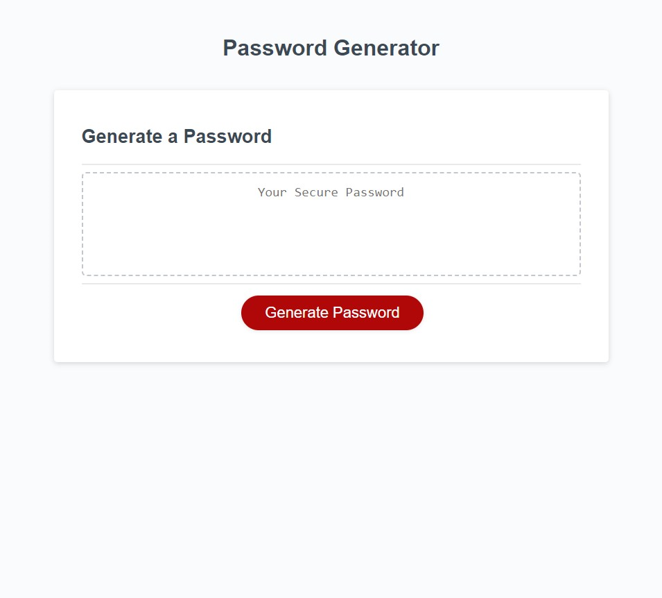

The password generator is coded with html css and JavaScript.
The html code and css code allows the webpage and user interface to be fluid. It allows the user to interact with the application in a very intuitive way just by pushing the visible red button the application will use all the characters randomly to generate a password.
The user is prompted first by the window via prompt to enter the length of the password desired. then the window prompt will require the user to include all different kind of elements to generate a unique password.
Once the app generates the password with JavaScript the app displays the password in the window clearly visible to the user.
The main driver for the app is the javaScript code which will randomly select different characters from an array included by the user using Math random method.
The app style layout is created by css and uses all the attributes that are necessary to give it the appearance.
Overall the app generates password of varying length and it is populated by a diverse stock of elements selected randomly to give each generation a unique password.
The image below is the appearance of the app on the webpage.

